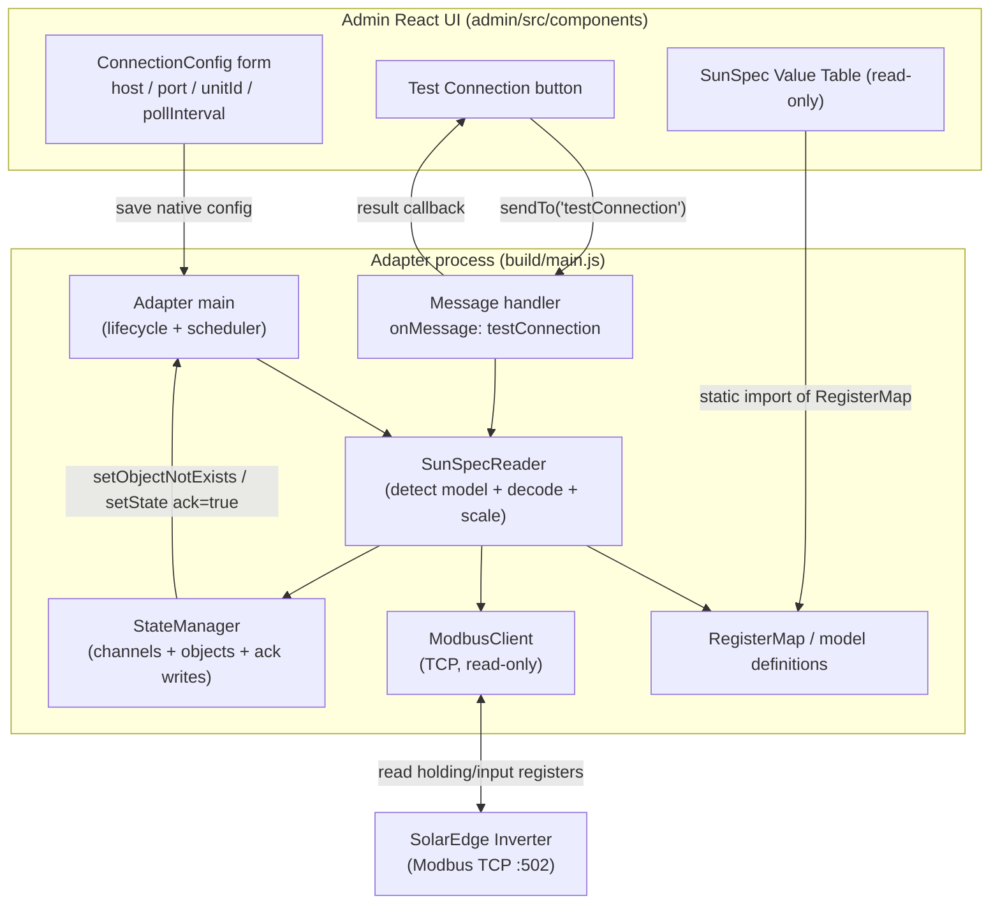

# Design Document: SolarEdge SunSpec Reader

## Overview

This feature turns the `sehybrid` ioBroker adapter into a **read-only** SunSpec Modbus TCP
monitor for SolarEdge hybrid inverters. The adapter connects to an inverter over Modbus TCP,
detects the present SunSpec inverter model (101/102/103) and meter model (201–204), reads the
associated register blocks, decodes the raw registers according to their SunSpec datatypes,
applies SunSpec scale factors, and publishes the resulting engineering values as acknowledged
ioBroker state objects on a configurable polling interval.

The design is grounded in the SolarEdge SunSpec implementation technical note
(`input/sunspec-implementation-technical-note-10.pdf`).

The feature is strictly **READ-ONLY**: the Modbus client issues only read function codes
(read holding registers / read input registers) and exposes no write path (Req 3.1). No export
limitation or storage control behavior is included, even though the package description mentions
such capabilities.

### Requirements Coverage Map

| Area | Requirements |
| --- | --- |
| Connection configuration (host/port/unitId) in admin | Req 1 |
| Connection test action from admin | Req 2 |
| Read-only SunSpec register reading over Modbus TCP | Req 3 |
| SunSpec value reference table in admin | Req 4 |
| Configurable polling interval | Req 5 |
| Mapping SunSpec values to ioBroker state objects | Req 6 |
| Connection indicator and adapter lifecycle | Req 7 |
| Standard ioBroker adapter compliance | Req 8 |

### Key Design Decisions

- **Modbus library:** add `modbus-serial` (current version `8.0.25`) as a runtime dependency.
  It is a mature pure-JavaScript Modbus RTU/TCP client, ships its own TypeScript types
  (`index.d.ts`), and declares `serialport` as an *optional* dependency — so a TCP-only,
  read-only deployment does not require any native serial bindings. We use only
  `readHoldingRegisters` / `readInputRegisters`; no write API is ever called (Req 3.1).
  `jsmodbus` is a viable alternative but modbus-serial has a simpler single-client API and
  broader adoption. Adding the dependency and pinning the version is an **implementation task**,
  not performed by this design.
- **Admin UI:** the existing React / `@iobroker/adapter-react` `GenericApp` admin
  (`admin/src/app.tsx` → `admin/src/components/settings`) is extended with React components for
  the connection form, the Test Connection button, and the read-only value table (Req 1, 2, 4).
  This is *not* a jsonConfig admin.
- **Connection test:** implemented through the adapter message box (`sendTo` / `onMessage`) with
  a `testConnection` command, requiring `common.messagebox: true` in `io-package.json` (Req 2).
- **Decoding and scale factors are pure functions** so they can be exhaustively property-tested
  with `fast-check` (Req 3.6–3.8).

---

## Architecture

The adapter is decomposed into focused modules. `main.ts` owns lifecycle and scheduling only;
all Modbus I/O, decoding, and object management live in dedicated `src/lib` modules so they can
be unit- and property-tested in isolation.



### Module Responsibilities

- **Adapter main (`src/main.ts`)** — implements `onReady`, `onUnload`, `onMessage`; validates the
  config, creates `info.connection`, starts and clears the polling timer, and orchestrates one
  cycle (Req 5, 7, 8). Holds the consecutive-failure counter (Req 8.5).
- **ModbusClient (`src/lib/modbus-client.ts`)** — thin wrapper over `modbus-serial`. Exposes only
  `connect`, `readHoldingRegisters`, `readInputRegisters`, and `close`, each with a 10 s timeout
  (Req 3.1, 3.2, 3.5, 7.4). No write method exists on the interface (Req 3.1).
- **SunSpecReader (`src/lib/sunspec-reader.ts`)** — detects the present inverter/meter model from
  the model identifier registers, reads the required blocks (≤125 registers per request), decodes
  registers via the datatype decoders, and resolves scale factors (Req 3.3, 3.4, 3.6, 3.7, 3.8).
- **RegisterMap (`src/lib/sunspec-map.ts`)** — the pure, static data describing every SunSpec
  register: name, model, offset, length, datatype, scale-factor reference, unit, role, ioBroker
  type. Shared by the reader and the admin value table (Req 4).
- **Decoders (`src/lib/sunspec-decode.ts`)** — pure functions that turn raw big-endian register
  words into typed values and apply scale factors and NOT_IMPLEMENTED sentinel detection
  (Req 3.6, 3.7, 3.8). Fully property-testable.
- **StateManager (`src/lib/state-manager.ts`)** — idempotent object/channel creation and
  acknowledged writes (Req 6).
- **Config validation (`src/lib/config-validation.ts`)** — shared pure validation used by both
  the adapter (on start and in `testConnection`) and the admin form (Req 1, 2.4, 5).
- **Admin React components (`admin/src/components`)** — connection form, Test Connection button,
  and read-only value table (Req 1, 2, 4).

### Data Flow: One Polling Cycle

1. The scheduler timer fires (interval = `pollInterval` seconds, Req 5.4).
2. `SunSpecReader` ensures the `ModbusClient` is connected; if the socket is closed it reconnects
   with a 10 s connect timeout (Req 7.4).
3. Reader reads the **Common block** (base 40000) to confirm the `"SunS"` identifier.
4. Reader reads the inverter model identifier at 40069, selects model 101/102/103, and reads that
   block (≤125 registers per request) with a 10 s read timeout (Req 3.3, 3.5).
5. Reader reads the meter model identifier and reads model 201/202/203/204 (Req 3.4).
6. For each register definition: decode the raw words per datatype (Req 3.7); if the raw value is
   a NOT_IMPLEMENTED sentinel, mark unavailable and skip (Req 3.8); otherwise resolve the scale
   factor and compute `raw * 10^SF` (Req 3.6); if the SF is missing or out of `[-10,10]`, log a
   warning and skip that value (Req 3.10).
7. `StateManager.ensureState` creates the object once (reused thereafter) and
   `StateManager.writeValue` writes the engineering value with `ack=true` (Req 6.1, 6.2, 6.8).
8. On full success, set `info.connection = true` and reset the failure counter (Req 7.2).
   On failure, set `info.connection = false`, log at error level, keep last values, increment the
   failure counter, and let the next tick retry (Req 5.5, 5.6, 7.3, 8.5).

If the cycle overruns the polling interval, the in-flight attempt is aborted (via the per-read
10 s timeout and a cycle guard), previous values are retained, and `info.connection` is set false
(Req 5.5).

---

## Components and Interfaces

All interfaces below are TypeScript, defined under `src/lib`. The adapter config type augments the
global `ioBroker.AdapterConfig` in `src/lib/adapter-config.d.ts`, replacing the placeholder
`option1`/`option2` fields.

### Adapter Configuration (Req 1, 5)

```typescript
// src/lib/adapter-config.d.ts (augmentation)
declare global {
    namespace ioBroker {
        interface AdapterConfig {
            /** Inverter IP address or hostname, 1..253 chars (Req 1.1). */
            host: string;
            /** Modbus TCP port, 1..65535, default 502 (Req 1.2, 1.3). */
            port: number;
            /** Modbus unit identifier, 0..247, default 1 (Req 1.4, 1.5). */
            unitId: number;
            /** Polling interval in seconds, 5..3600, default 30 (Req 5.1, 5.3). */
            pollInterval: number;
        }
    }
}
export {};
```

### SunSpec Datatypes and Register Definitions (Req 3.7, 4, 6)

```typescript
export type SunSpecDatatype =
    | 'int16'
    | 'uint16'
    | 'int32'
    | 'uint32'
    | 'acc32'
    | 'float32'
    | 'sunssf'   // scale factor, stored as int16
    | 'string';

/** Physical role/quantity, used to pick the ioBroker common.role (Req 6.4). */
export type SunSpecRole =
    | 'current' | 'voltage' | 'power' | 'power.reactive' | 'power.apparent'
    | 'powerFactor' | 'frequency' | 'energy' | 'temperature' | 'status' | 'info';

export interface SunSpecRegisterDef {
    /** Stable key used as the ioBroker state id leaf, e.g. "acPower". */
    name: string;
    /** SunSpec model this value belongs to (Req 4.3). */
    model: 101 | 102 | 103 | 201 | 202 | 203 | 204 | 'common';
    /** Register offset (in words) from the model block base address. */
    offset: number;
    /** Number of 16-bit registers occupied by this value. */
    length: number;
    datatype: SunSpecDatatype;
    /** name of the sunssf register that scales this value, if any (Req 3.6). */
    scaleFactorRef?: string;
    /** Physical unit for common.unit, omitted when unitless (Req 6.5, 6.6). */
    unit?: string;
    /** Logical quantity, drives role selection (Req 6.4). */
    role: SunSpecRole;
    /** Resolved ioBroker common.type (Req 6.3). */
    iobType: 'number' | 'string';
}
```

### Decode Functions (Req 3.6, 3.7, 3.8)

```typescript
/** Decode raw big-endian registers into a typed primitive. Returns null when
 *  the raw value equals the NOT_IMPLEMENTED sentinel for the datatype (Req 3.8). */
export function decodeRegisters(
    words: readonly number[],
    datatype: SunSpecDatatype,
): number | string | null;

/** True when raw words equal the NOT_IMPLEMENTED sentinel for the datatype (Req 3.8). */
export function isNotImplemented(
    words: readonly number[],
    datatype: SunSpecDatatype,
): boolean;

/** Apply a SunSpec scale factor: engineering = raw * 10^sf.
 *  Throws/returns error when sf is outside [-10, 10] (Req 3.6, 3.10). */
export function applyScaleFactor(raw: number, sf: number): number;
```

### ModbusClient Interface (Req 3.1, 3.2, 3.5, 7.4, 7.6)

```typescript
export interface ModbusReadOptions {
    /** Overall timeout for the operation in ms; defaults to 10000 (Req 3.5). */
    timeoutMs?: number;
}

/** READ-ONLY client. There is deliberately NO write method (Req 3.1). */
export interface IModbusClient {
    /** Open a TCP connection with a connect timeout (default 10s) (Req 7.4). */
    connect(host: string, port: number, unitId: number, timeoutMs?: number): Promise<void>;
    /** FC03 read; max 125 registers enforced by caller (Req 3.2). */
    readHoldingRegisters(address: number, length: number, opts?: ModbusReadOptions): Promise<number[]>;
    /** FC04 read. */
    readInputRegisters(address: number, length: number, opts?: ModbusReadOptions): Promise<number[]>;
    /** Whether a socket is currently open. */
    isConnected(): boolean;
    /** Close the socket; resolves within 10s (Req 7.6). */
    close(): Promise<void>;
}
```

### SunSpecReader Interface (Req 3.3, 3.4)

```typescript
export type InverterModelId = 101 | 102 | 103;
export type MeterModelId = 201 | 202 | 203 | 204;

export interface DecodedValue {
    def: SunSpecRegisterDef;
    /** Engineering value, or null when unavailable (NOT_IMPLEMENTED / skipped). */
    value: number | string | null;
}

export interface ISunSpecReader {
    /** Read model id at inverter base and return 101/102/103, or null if absent (Req 3.3, 3.9). */
    detectInverterModel(client: IModbusClient): Promise<InverterModelId | null>;
    /** Read model id at meter base and return 201..204, or null if absent (Req 3.4, 3.9). */
    detectMeterModel(client: IModbusClient): Promise<MeterModelId | null>;
    /** Read + decode the detected inverter block (Req 3.3, 3.6, 3.7, 3.8). */
    readInverter(client: IModbusClient, model: InverterModelId): Promise<DecodedValue[]>;
    /** Read + decode the detected meter block (Req 3.4, 3.6, 3.7, 3.8). */
    readMeter(client: IModbusClient, model: MeterModelId): Promise<DecodedValue[]>;
}
```

### StateManager Interface (Req 6, 7.1)

```typescript
export interface IStateManager {
    /** Create channel object once (inverter | meter | info) (Req 6.9). */
    ensureChannel(channel: 'inverter' | 'meter'): Promise<void>;
    /** Create the state object once from its register def; reuse if present (Req 6.1–6.7). */
    ensureState(channel: 'inverter' | 'meter', def: SunSpecRegisterDef): Promise<void>;
    /** Write an engineering value with ack=true; no-op when value is null (Req 3.8, 6.8, 8.1). */
    writeValue(channel: 'inverter' | 'meter', def: SunSpecRegisterDef,
               value: number | string | null): Promise<void>;
}
```

### Test-Connection Message Contract (Req 2)

The admin sends a message through the adapter message box; the adapter validates the config,
performs a live, read-only, ≤10 s probe of the SunSpec identifier block, closes the socket, and
replies (Req 2.2, 2.3, 2.4, 2.5).

```typescript
/** obj.command === 'testConnection' */
export interface TestConnectionRequest {
    host: string;
    port: number;
    unitId: number;
}

export type TestConnectionResponse =
    | { result: 'success'; manufacturer?: string; model?: string }
    | { result: 'validationError'; message: string }   // replied within 1s, no TCP (Req 2.4)
    | { result: 'failure'; message: string };           // unreachable / timeout (Req 2.3)
```

Config validation (`src/lib/config-validation.ts`) is shared between the admin form (Req 1.7–1.9,
5.2) and this handler (Req 2.4):

```typescript
export interface ConfigValidationResult {
    valid: boolean;
    errors: Partial<Record<'host' | 'port' | 'unitId' | 'pollInterval', string>>;
}
export function validateConfig(cfg: Partial<ioBroker.AdapterConfig>): ConfigValidationResult;
```

---

## Data Models

### Register Map Structure

The register map is a static array of `SunSpecRegisterDef` grouped by SunSpec model. Addresses use
the SolarEdge base-0 register numbers from the technical note. All words are **big-endian**
(Req 3.7). Multi-word values (`int32`, `uint32`, `acc32`, `float32`) occupy 2 registers,
most-significant word first; strings occupy their declared word count as packed bytes.

```typescript
export const COMMON_BASE = 40000;   // C_SunSpec_ID "SunS" at 40000
export const INVERTER_BASE = 40069; // model id at 40069
export const METER_BASE = 40121;    // first meter block region

export const SUNSPEC_MAP: SunSpecRegisterDef[] = [ /* see tables below */ ];
```

### Common Block (base 40000) — used for detection / identity (Req 3.3)

| Name | Addr | Type | Length | Notes |
| --- | --- | --- | --- | --- |
| C_SunSpec_ID | 40000 | uint32 | 2 | Must equal `0x53756e53` ("SunS") |
| C_SunSpec_DID | 40002 | uint16 | 1 | Common model DID |
| C_SunSpec_Length | 40003 | uint16 | 1 | 65 |
| C_Manufacturer | 40004 | string | 16 | 32 chars |
| C_Model | 40020 | string | 16 | 32 chars |
| C_DeviceAddress | 40068 | uint16 | 1 | Modbus unit id |

The common block is read for detection and for the Test Connection identity fields; these are not
required to be exposed as measurement states.

### Inverter Block (models 101/102/103, base 40069) (Req 3.3, 6)

Model id at 40069 selects the block: 101 = single phase, 102 = split phase, 103 = three phase.
Scale-factor registers are shared `sunssf` (int16) values referenced by name.

| Name | Addr | Type | SF ref | Unit | Role → ioBroker role | iobType |
| --- | --- | --- | --- | --- | --- | --- |
| acCurrent | 40071 | uint16 | acCurrentSF | A | current → `value.current` | number |
| acCurrentSF | 40075 | sunssf | – | – | (scale) | number |
| acVoltageAB | 40076 | uint16 | acVoltageSF | V | voltage → `value.voltage` | number |
| acVoltageBC | 40077 | uint16 | acVoltageSF | V | voltage → `value.voltage` | number |
| acVoltageCA | 40078 | uint16 | acVoltageSF | V | voltage → `value.voltage` | number |
| acVoltageAN | 40079 | uint16 | acVoltageSF | V | voltage → `value.voltage` | number |
| acVoltageBN | 40080 | uint16 | acVoltageSF | V | voltage → `value.voltage` | number |
| acVoltageCN | 40081 | uint16 | acVoltageSF | V | voltage → `value.voltage` | number |
| acVoltageSF | 40082 | sunssf | – | – | (scale) | number |
| acPower | 40083 | int16 | acPowerSF | W | power → `value.power.active` | number |
| acPowerSF | 40084 | sunssf | – | – | (scale) | number |
| acFrequency | 40085 | uint16 | acFrequencySF | Hz | frequency → `value.frequency` | number |
| acFrequencySF | 40086 | sunssf | – | – | (scale) | number |
| acVA | 40087 | int16 | acVASF | VA | power.apparent → `value.power` | number |
| acVASF | 40088 | sunssf | – | – | (scale) | number |
| acVAR | 40089 | int16 | acVARSF | var | power.reactive → `value.power` | number |
| acVARSF | 40090 | sunssf | – | – | (scale) | number |
| acPF | 40091 | int16 | acPFSF | % | powerFactor → `value` | number |
| acPFSF | 40092 | sunssf | – | – | (scale) | number |
| acEnergyWh | 40093 | acc32 | acEnergyWhSF | Wh | energy → `value.energy` | number |
| acEnergyWhSF | 40095 | uint16 | – | – | (scale) | number |
| dcCurrent | 40096 | uint16 | dcCurrentSF | A | current → `value.current` | number |
| dcCurrentSF | 40097 | sunssf | – | – | (scale) | number |
| dcVoltage | 40098 | uint16 | dcVoltageSF | V | voltage → `value.voltage` | number |
| dcVoltageSF | 40099 | sunssf | – | – | (scale) | number |
| dcPower | 40100 | int16 | dcPowerSF | W | power → `value.power.active` | number |
| dcPowerSF | 40101 | sunssf | – | – | (scale) | number |
| tempSink | 40103 | int16 | tempSF | °C | temperature → `value.temperature` | number |
| tempSF | 40106 | sunssf | – | – | (scale) | number |
| status | 40107 | uint16 | – | – | status → `indicator` | number |
| statusVendor | 40108 | uint16 | – | – | info → `indicator` | number |

### Meter Block (models 201/202/203/204, first meter region) (Req 3.4, 6)

Model id (`C_SunSpec_DID`) selects the block: 201 single phase, 202 split phase, 203 wye
three-phase, 204 delta three-phase. Each meter block carries AC current, voltage, power,
frequency, and energy import/export values, each with its own `sunssf` scale factor, structured
like the inverter block.

| Name | Type | SF ref | Unit | Role → ioBroker role | iobType |
| --- | --- | --- | --- | --- | --- |
| mCurrent | int16 | mCurrentSF | A | current → `value.current` | number |
| mCurrentSF | sunssf | – | – | (scale) | number |
| mVoltageLN | int16 | mVoltageSF | V | voltage → `value.voltage` | number |
| mVoltageSF | sunssf | – | – | (scale) | number |
| mFrequency | int16 | mFrequencySF | Hz | frequency → `value.frequency` | number |
| mFrequencySF | sunssf | – | – | (scale) | number |
| mPower | int16 | mPowerSF | W | power → `value.power.active` | number |
| mPowerSF | sunssf | – | – | (scale) | number |
| mExportedWh | acc32 | mEnergyWhSF | Wh | energy → `value.energy` | number |
| mImportedWh | acc32 | mEnergyWhSF | Wh | energy → `value.energy` | number |
| mEnergyWhSF | sunssf | – | – | (scale) | number |

> The exact meter register offsets follow the SolarEdge technical note for the selected meter
> model; the implementation task populates the concrete offsets from the PDF. Datatypes, units,
> roles, and scale-factor references are fixed as above (Req 3.4, 3.7, 6.3–6.6).

### Object Tree (Req 6.9, 7.1)

```
sehybrid.<instance>
├── info
│   └── connection        (boolean, role=indicator.connected)   ← Req 7.1
├── inverter              (channel)                              ← Req 6.9
│   ├── acPower           (number, role=value.power.active, unit=W)
│   ├── acEnergyWh        (number, role=value.energy, unit=Wh)
│   └── ...               (one state per inverter register def)
└── meter                 (channel)                              ← Req 6.9
    ├── mPower            (number, role=value.power.active, unit=W)
    ├── mExportedWh       (number, role=value.energy, unit=Wh)
    └── ...               (one state per meter register def)
```

State object metadata is derived deterministically from the register def (Req 6.3–6.7):
- `common.type` = `def.iobType` (`number` for all numeric SunSpec datatypes incl. `sunssf`;
  `string` for `string`) (Req 6.3).
- `common.role` from `def.role` per the mapping in the tables (Req 6.4).
- `common.unit` = `def.unit` when present; the property is omitted otherwise (Req 6.5, 6.6).
- `common.read = true`, `common.write = false` (Req 6.7).

`sunssf` scale-factor registers and the common identity strings are internal and are **not**
created as measurement states; only the resolved engineering values are exposed.

### Scale-Factor Resolution (Req 3.6, 3.10)

For a value with `scaleFactorRef`, the reader looks up the referenced `sunssf` register value in
the same decoded block. If the SF is present and an integer in `[-10, 10]`, the engineering value
is `raw * 10^SF` (Req 3.6). If the SF register is missing from the block or its value is outside
`[-10, 10]` (including its own NOT_IMPLEMENTED sentinel `0x8000`), the value is skipped, a warning
is logged naming the affected value, and processing continues (Req 3.10).

### NOT_IMPLEMENTED Handling (Req 3.8)

Sentinels by datatype:

| Datatype | Sentinel |
| --- | --- |
| int16 / sunssf | `0x8000` |
| uint16 | `0xFFFF` |
| int32 | `0x80000000` |
| uint32 / acc32 | `0xFFFFFFFF` |

When a decoded raw value equals its datatype sentinel, `decodeRegisters` returns `null`, the value
is treated as unavailable, and **no** state write occurs for that value this cycle (Req 3.8). The
previously stored acknowledged value (if any) is retained.

---

## Correctness Properties

*A property is a characteristic or behavior that should hold true across all valid executions of a
system — essentially, a formal statement about what the system should do. These serve as the bridge
between human-readable specifications and machine-verifiable correctness guarantees.*

This section applies property-based testing because the decoders, scale-factor math, config
validation, and metadata mapping are **pure functions** with large input spaces. Each
characteristic below is written for [`fast-check`](https://www.npmjs.com/package/fast-check) and
runs alongside the existing `npm run test:ts` mocha suite. UI persistence, scheduling, connectivity,
and reconnection are verified by example/integration tests instead (see Testing Strategy). Every
such test is tagged with the feature name and its number (`Feature: solaredge-sunspec-reader` /
number N) and runs a minimum of 100 iterations.

### Property 1: Datatype decode round-trip (big-endian)

*For all* values representable by a SunSpec numeric datatype (int16, uint16, int32, uint32, acc32,
float32) and for all strings up to a string field's length, encoding the value into big-endian
16-bit registers and then decoding it with `decodeRegisters` yields the original value.

**Validates: Requirements 3.7**

### Property 2: Scale-factor application and domain

*For all* raw integers and *for all* scale factors `sf` in `[-10, 10]`, `applyScaleFactor(raw, sf)`
equals `raw * 10^sf`; and *for all* `sf` outside `[-10, 10]` (or a missing/sentinel SF), scale
resolution rejects the value so it is skipped rather than written.

**Validates: Requirements 3.6, 3.10**

### Property 3: NOT_IMPLEMENTED sentinels map to unavailable and are never written

*For all* SunSpec datatypes, register words equal to that datatype's NOT_IMPLEMENTED sentinel
decode to `null` (unavailable), and *for all* register definitions, `writeValue` invoked with a
`null` value performs no state write, while a non-null value is written with `ack = true`.

**Validates: Requirements 3.8, 6.8, 8.1**

### Property 4: Read-only invariant

*For all* sequences of reader operations against the Modbus client, the only Modbus function codes
issued are read holding registers (FC03) and read input registers (FC04); no write function code
is ever issued, and the `IModbusClient` interface exposes no write method.

**Validates: Requirements 3.1**

### Property 5: Configuration validation boundaries

*For all* candidate configurations, `validateConfig` accepts the configuration if and only if the
host is a string of length 1..253, the port is an integer in `[1, 65535]`, the unit id is an
integer in `[0, 247]`, and the poll interval is an integer in `[5, 3600]`; any input violating a
bound is rejected with an error naming the offending field.

**Validates: Requirements 1.1, 1.2, 1.4, 2.4, 5.1**

### Property 6: State metadata mapping is total and correct

*For all* register definitions in the register map, the derived ioBroker object has a valid
`common.type` (`number` for every numeric datatype including `sunssf`, `string` for `string`), a
`common.role` drawn from the allowed ioBroker role set, `common.read = true`, `common.write =
false`, and `common.unit` present exactly when the definition declares a unit.

**Validates: Requirements 6.3, 6.4, 6.5, 6.6, 6.7**

### Property 7: Idempotent object creation

*For all* register definitions, calling `ensureState` any number of times results in the object
being created exactly once and reused on every subsequent call.

**Validates: Requirements 6.1, 6.2**

### Property 8: Read requests never exceed 125 registers

*For all* register block lengths, the reader's chunking of a block into Modbus read requests emits
requests that each cover at most 125 registers and that together cover the whole block exactly once.

**Validates: Requirements 3.2**

### Property 9: Value table has one row per SunSpec value with required fields

*For all* register maps, the rendered value table contains exactly one row per non-scale SunSpec
value definition, and each row includes that value's name, Modbus datatype, and SunSpec model id.

**Validates: Requirements 4.1, 4.2, 4.3**

---

## Error Handling

All Modbus/polling errors are treated as **recoverable**: they are logged and the adapter keeps
running so the next interval retries (Req 5.6, 8.2). Log levels follow the required mapping —
debug for routine reads, info for lifecycle events, warn for recoverable anomalies, error for
failures that set `info.connection = false` (Req 8.3).

| Condition | Handling | Requirements |
| --- | --- | --- |
| Missing `host` at startup | Log error, set `info.connection = false`, do not start polling timer | Req 8.4 |
| Invalid config at Test Connection | Reply `validationError` within 1 s, no TCP attempt | Req 2.4 |
| Connect failure / unreachable | Cycle fails: `info.connection = false`, error log, retain last values; reconnect next cycle (10 s connect timeout) | Req 7.3, 7.4 |
| Read timeout (10 s) | Abort read, treat cycle as failed, retain last values, `info.connection = false` | Req 3.5, 5.5, 7.3 |
| Cycle overruns poll interval | Abort in-flight attempt, retain values, `info.connection = false` | Req 5.5 |
| Missing SunSpec model block | Log warning naming the model, continue with remaining blocks (do not fail whole cycle for a missing optional block) | Req 3.9 |
| Missing / out-of-range scale factor | Skip affected value, log warning naming the value, continue | Req 3.10 |
| NOT_IMPLEMENTED sentinel | Treat value as unavailable, write nothing for it this cycle | Req 3.8 |
| 10 consecutive recoverable failures | Set `info.connection = false`, log error about repeated read failures, keep scheduling | Req 8.5 |
| Reconnect succeeds on later cycle | Set `info.connection = true` after successful map read | Req 7.5 |
| Adapter unload | Clear polling timer/interval, close Modbus socket within 10 s, invoke callback | Req 7.6 |

The consecutive-failure counter lives in `main.ts`: incremented on any failed cycle, reset to 0 on
a fully successful cycle. On reaching 10 it triggers the repeated-failure error log (Req 8.5) but
does not stop scheduling (Req 5.6).

---

## Testing Strategy

The project already provides the test scripts used here: `npm run test:ts` (mocha + ts-node over
`src/**/*.test.ts`), `npm run test:package`, `npm run test:integration`, `npm run check`
(`tsc --noEmit` for adapter and admin), and `npm run lint`.

### Property-Based Tests (fast-check) — `src/lib/*.test.ts`

`fast-check` is added as a dev dependency (implementation task). Each property from the section
above becomes a **single** property test, minimum 100 iterations, tagged with the feature name and
its property number (`Feature: solaredge-sunspec-reader` / property N):

- P1 decode round-trip (Req 3.7)
- P2 scale-factor application + out-of-range rejection (Req 3.6, 3.10)
- P3 sentinel → unavailable / null → no write, non-null → ack write (Req 3.8, 6.8, 8.1)
- P4 read-only invariant over reader operations against a recording mock client (Req 3.1)
- P5 config validation boundaries (Req 1.1, 1.2, 1.4, 2.4, 5.1)
- P6 metadata mapping totality over the register map with a mocked adapter (Req 6.3–6.7)
- P7 idempotent `ensureState` with a mocked adapter (Req 6.1, 6.2)
- P8 read-chunk ≤ 125 (Req 3.2)
- P9 value-table rendering totality (Req 4.1–4.3)

### Unit / Example Tests

- **Config defaults** (Req 1.3, 1.5, 5.3): unset fields default to port 502, unitId 1, interval 30.
- **StateManager** with a mocked `ioBroker.Adapter`: channel grouping into `inverter`/`meter`
  (Req 6.9), object metadata for representative defs, ack writes (Req 6.8).
- **SunSpecReader detection**: for each inverter model 101/102/103 and meter model 201–204, a mock
  client returning the corresponding DID drives the correct block read (Req 3.3, 3.4); a mock with
  a missing block produces a warning and continues (Req 3.9).
- **Lifecycle guards**: missing-host startup guard (Req 8.4); unload clears timer and closes socket
  (Req 7.6); log-level mapping on representative events (Req 8.3); 10-consecutive-failure counter
  boundary (Req 8.5).
- **Admin components** (React, mirrors `admin/src/components/settings` structure): connection form
  reject/retain on invalid host/port/unitId (Req 1.6–1.9), poll-interval retain (Req 5.2), Test
  Connection button present (Req 2.1), value table read-only with no editable controls (Req 4.4)
  and empty-map indication (Req 4.5).

### Integration Tests — `@iobroker/testing` + mock Modbus TCP server (`test/integration`)

A lightweight in-process Modbus TCP server (a small mock serving canned SunSpec register blocks,
or `modbus-serial`'s own server helper) backs these tests:

- Full polling cycle: server serves Common + inverter + meter blocks → states created with correct
  values and `info.connection = true` (Req 3.3, 3.4, 5.4, 6, 7.2).
- `testConnection` message: valid config against reachable mock → `success`; unreachable/slow mock
  → `failure` within ~10 s; invalid config → `validationError` within 1 s with no connection
  attempt; socket closed after test (Req 2.2, 2.3, 2.4, 2.5).
- Read timeout and reconnect: a non-responding then recovering mock exercises the 10 s timeout,
  `info.connection` false→true transition, and value retention (Req 3.5, 5.5, 7.3, 7.4, 7.5).

### Manual / Out of Scope

Verification against a **live SolarEdge inverter** is manual: confirm the detected model, spot-check
scaled values against the SolarEdge portal, and confirm no writes occur on the device. This is
documented for the maintainer and is not automated (external hardware).

### Dependency Note

Adding `modbus-serial@8.0.25` to `package.json` `dependencies` and `fast-check` to `devDependencies`
is an **implementation task**, not performed by this design.
