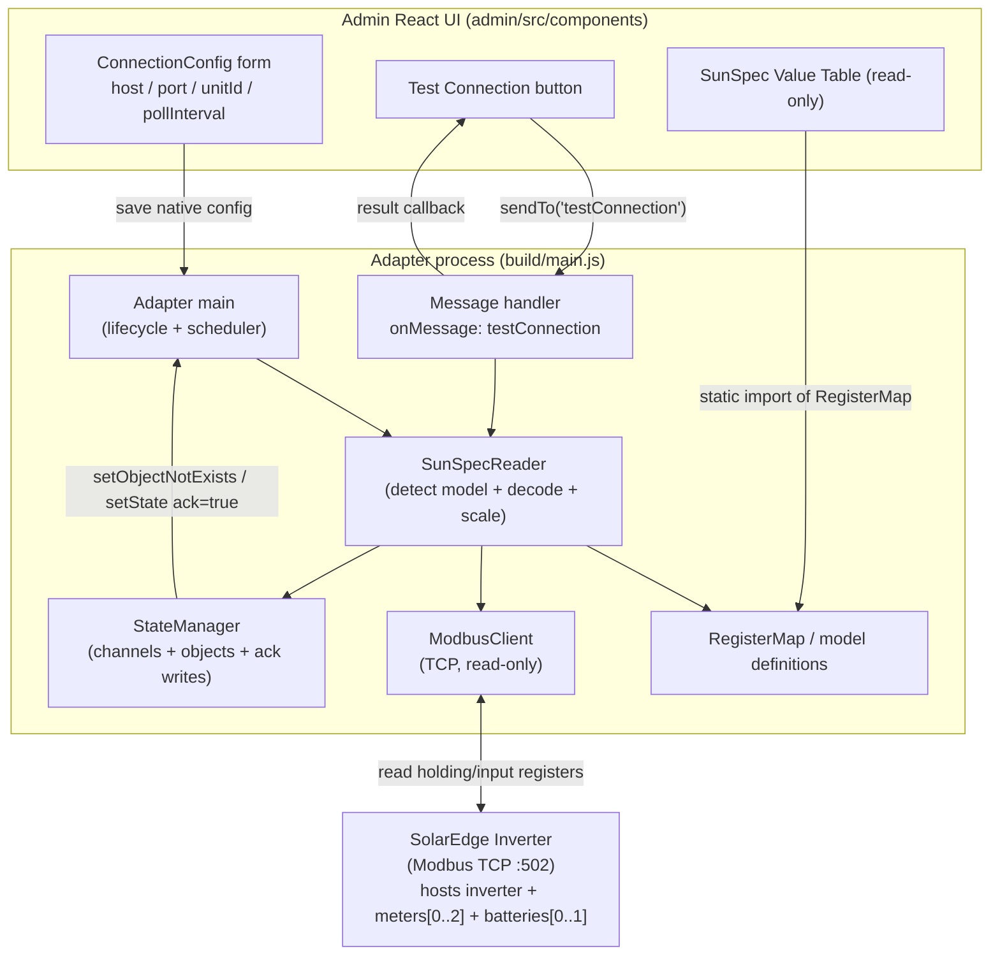

# Design Document: SolarEdge SunSpec Reader

## Overview

This feature turns the `sehybrid` ioBroker adapter into a **read-only** SunSpec Modbus TCP
monitor for SolarEdge hybrid inverters. The adapter connects to an inverter over Modbus TCP,
detects the present SunSpec inverter model (101/102/103), up to three meters (models 201–204),
and up to two batteries hosted on the inverter, reads the associated register blocks, decodes
the raw registers according to their SunSpec datatypes, applies SunSpec scale factors, and
publishes the resulting engineering values as acknowledged ioBroker state objects on a
configurable polling interval (Req 3, 9, 10, 11).

The design is grounded in the SolarEdge SunSpec implementation technical note
(`input/sunspec-implementation-technical-note-10.pdf`) and, for the multi-meter offsets, the
battery register block, and the extended datatypes, in the **authoritative**
[`nmakel/solaredge_modbus`](https://github.com/nmakel/solaredge_modbus) reference register maps.
Where the reference and the PDF describe the same physical registers (for example Meter 1), the
addresses agree; this design generalizes the single meter block into a reusable template that is
instantiated per meter with a per-device word offset. Content was rephrased for compliance with
licensing restrictions.

The feature is strictly **READ-ONLY**: the Modbus client issues only read function codes
(read holding registers / read input registers) and exposes no write path (Req 3.1). No export
limitation or storage control behavior is included, even though the package description mentions
such capabilities.

### Requirements Coverage Map

| Area | Requirements |
| --- | --- |
| Connection configuration (host/port/unitId) in admin | Req 1 |
| Connection test action from admin | Req 2 |
| Read-only SunSpec register reading over Modbus TCP | Req 3 |
| SunSpec value reference table in admin | Req 4 |
| Configurable polling interval | Req 5 |
| Mapping SunSpec values to ioBroker state objects | Req 6 |
| Connection indicator and adapter lifecycle | Req 7 |
| Standard ioBroker adapter compliance | Req 8 |
| Multiple meter support (up to 3, per-device offsets/channels) | Req 9 |
| Battery support (up to 2, float32-LE / uint64 decode) | Req 10 |
| Device datatype support (float32-LE, uint64) | Req 11 |

### Key Design Decisions

- **Modbus library:** add `modbus-serial` (current version `8.0.25`) as a runtime dependency.
  It is a mature pure-JavaScript Modbus RTU/TCP client, ships its own TypeScript types
  (`index.d.ts`), and declares `serialport` as an *optional* dependency — so a TCP-only,
  read-only deployment does not require any native serial bindings. We use only
  `readHoldingRegisters` / `readInputRegisters`; no write API is ever called (Req 3.1).
  `jsmodbus` is a viable alternative but modbus-serial has a simpler single-client API and
  broader adoption. Adding the dependency and pinning the version is an **implementation task**,
  not performed by this design.
- **Admin UI:** the existing React / `@iobroker/adapter-react` `GenericApp` admin
  (`admin/src/app.tsx` → `admin/src/components/settings`) is extended with React components for
  the connection form, the Test Connection button, and the read-only value table (Req 1, 2, 4).
  This is *not* a jsonConfig admin.
- **Connection test:** implemented through the adapter message box (`sendTo` / `onMessage`) with
  a `testConnection` command, requiring `common.messagebox: true` in `io-package.json` (Req 2).
- **Decoding and scale factors are pure functions** so they can be exhaustively property-tested
  with `fast-check` (Req 3.6–3.8).

---

## Architecture

The adapter is decomposed into focused modules. `main.ts` owns lifecycle and scheduling only;
all Modbus I/O, decoding, and object management live in dedicated `src/lib` modules so they can
be unit- and property-tested in isolation.



### Device-Block Concept (Req 9, 10)

The adapter now reads three *kinds* of device, all hosted on the single inverter Modbus map:
the inverter, up to three meters, and up to two batteries. Rather than hardcoding one meter
block and one battery block, the design introduces a generic **device block**: a register
*template* (a set of `SunSpecRegisterDef`s expressed as word offsets from a block base) combined
with a per-device *base/offset* and a *DID (presence) register*. Instantiating a template at a
device's base/offset yields that device's concrete absolute addresses and its own channel:

- **Meter template** + `METER_REGISTER_OFFSETS = [0, 174, 348]` (words; `0x0`, `0xAE`, `0x15C`)
  → meters at DID `40188 / 40362 / 40536`, channels `meter.1.* / meter.2.* / meter.3.*` (Req 9).
- **Battery template** + `BATTERY_REGISTER_OFFSETS = [0, 256]` (words; `0x0`, `0x100`), base
  `0xE100 (57600)` → batteries at base `57600 / 57856`, DID `0xE140 / 0xE240`, channels
  `battery.1.* / battery.2.*` (Req 10). The battery block uses **little-endian word order**.

A device is only read (and only exposed as states) when its DID register indicates presence:
a meter slot when its DID ∈ {201,202,203,204} (Req 9.2), a battery slot when its DID is neither
the not-implemented sentinel nor 255 (Req 10.1).

### Module Responsibilities

- **Adapter main (`src/main.ts`)** — implements `onReady`, `onUnload`, `onMessage`; validates the
  config, creates `info.connection`, starts and clears the polling timer, and orchestrates one
  cycle (Req 5, 7, 8). Holds the consecutive-failure counter (Req 8.5).
- **ModbusClient (`src/lib/modbus-client.ts`)** — thin wrapper over `modbus-serial`. Exposes only
  `connect`, `readHoldingRegisters`, `readInputRegisters`, and `close`, each with a 10 s timeout
  (Req 3.1, 3.2, 3.5, 7.4). No write method exists on the interface (Req 3.1).
- **SunSpecReader (`src/lib/sunspec-reader.ts`)** — detects the present inverter model, the
  present meter slots (0..3), and the present battery slots (0..2) from the model/DID registers,
  reads the required blocks (≤125 registers per request), decodes registers via the datatype
  decoders (including `float32le` and `uint64` for batteries), and resolves scale factors
  (Req 3.3, 3.4, 3.6, 3.7, 3.8, 9.1, 9.2, 10.1, 10.2). It instantiates the meter and battery
  templates at each present device's base/offset.
- **RegisterMap (`src/lib/sunspec-map.ts`)** — the pure, static data describing every SunSpec
  register: name, model, offset, length, datatype, scale-factor reference, unit, role, ioBroker
  type. Now also exports the **meter template + `METER_REGISTER_OFFSETS`** and the **battery
  template + `BATTERY_REGISTER_OFFSETS`** and the per-device address helper. Shared by the reader
  and the admin value table (Req 4, 9, 10).
- **Decoders (`src/lib/sunspec-decode.ts`)** — pure functions that turn raw register words into
  typed values and apply scale factors and NOT_IMPLEMENTED sentinel detection (Req 3.6, 3.7,
  3.8). Handles big-endian datatypes plus `float32le` (IEEE-754 float32, little-endian word
  order) and `uint64` for batteries (Req 10.3, 10.4, 11.2, 11.3). Fully property-testable.
- **StateManager (`src/lib/state-manager.ts`)** — idempotent object/channel creation and
  acknowledged writes (Req 6).
- **Config validation (`src/lib/config-validation.ts`)** — shared pure validation used by both
  the adapter (on start and in `testConnection`) and the admin form (Req 1, 2.4, 5).
- **Admin React components (`admin/src/components`)** — connection form, Test Connection button,
  and read-only value table (Req 1, 2, 4).

### Data Flow: One Polling Cycle

1. The scheduler timer fires (interval = `pollInterval` seconds, Req 5.4).
2. `SunSpecReader` ensures the `ModbusClient` is connected; if the socket is closed it reconnects
   with a 10 s connect timeout (Req 7.4).
3. Reader reads the **Common block** (base 40000) to confirm the `"SunS"` identifier.
4. Reader reads the inverter model identifier at 40069, selects model 101/102/103, and reads that
   block (≤125 registers per request) with a 10 s read timeout (Req 3.3, 3.5).
5. **Meters (Req 9):** for each meter slot `n ∈ {1,2,3}`, the reader reads the meter DID register
   at `40188 + METER_REGISTER_OFFSETS[n-1]`. If the DID ∈ {201,202,203,204} the slot is present:
   the reader instantiates the meter template at that offset and reads model 201/202/203/204
   (Req 3.4, 9.1, 9.2). If the DID is not a meter model, the slot is skipped with a warning and no
   states are created (Req 9.4).
6. **Batteries (Req 10):** for each battery slot `n ∈ {1,2}`, the reader reads the battery DID
   register at `0xE140 + BATTERY_REGISTER_OFFSETS[n-1]`. If the DID is neither the not-implemented
   sentinel nor 255 the slot is present: the reader instantiates the battery template at base
   `0xE100 + BATTERY_REGISTER_OFFSETS[n-1]` and reads/decodes the block using little-endian word
   order for `float32le` and `uint64` (Req 10.1, 10.2, 10.3, 10.4). Absent slots are skipped with a
   warning and no states (Req 10.9).
7. For each register definition of each present device: decode the raw words per datatype (Req 3.7,
   11); if the raw value is a NOT_IMPLEMENTED sentinel, mark unavailable and skip (Req 3.8, 10.8);
   otherwise resolve the scale factor and compute `raw * 10^SF` (Req 3.6); if the SF is missing or
   out of `[-10,10]`, log a warning and skip that value (Req 3.10). Battery values are already in
   engineering units (float32/uint64) and carry no scale factor.
8. `StateManager.ensureState` creates the object once under the device's channel
   (`inverter` / `meter.<n>` / `battery.<n>`), reused thereafter, and `StateManager.writeValue`
   writes the engineering value with `ack=true` (Req 6.1, 6.2, 6.8, 9.3, 10.5).
9. On success of the **inverter** block, set `info.connection = true` and reset the failure counter
   (Req 7.2). Meter/battery slot absence is not a failure (see Error Handling).
   On inverter-read failure, set `info.connection = false`, log at error level, keep last values,
   increment the failure counter, and let the next tick retry (Req 5.5, 5.6, 7.3, 8.5).

If the cycle overruns the polling interval, the in-flight attempt is aborted (via the per-read
10 s timeout and a cycle guard), previous values are retained, and `info.connection` is set false
(Req 5.5).

---

## Components and Interfaces

All interfaces below are TypeScript, defined under `src/lib`. The adapter config type augments the
global `ioBroker.AdapterConfig` in `src/lib/adapter-config.d.ts`, replacing the placeholder
`option1`/`option2` fields.

### Adapter Configuration (Req 1, 5)

```typescript
// src/lib/adapter-config.d.ts (augmentation)
declare global {
    namespace ioBroker {
        interface AdapterConfig {
            /** Inverter IP address or hostname, 1..253 chars (Req 1.1). */
            host: string;
            /** Modbus TCP port, 1..65535, default 502 (Req 1.2, 1.3). */
            port: number;
            /** Modbus unit identifier, 0..247, default 1 (Req 1.4, 1.5). */
            unitId: number;
            /** Polling interval in seconds, 5..3600, default 30 (Req 5.1, 5.3). */
            pollInterval: number;
        }
    }
}
export {};
```

### SunSpec Datatypes and Register Definitions (Req 3.7, 4, 6)

```typescript
export type SunSpecDatatype =
    | 'int16'
    | 'uint16'
    | 'int32'
    | 'uint32'
    | 'acc32'
    | 'float32'    // IEEE-754 float32, BIG-endian word order (SunSpec inverter/meter)
    | 'float32le'  // IEEE-754 float32, LITTLE-endian word order (battery block, Req 10.3, 11.2)
    | 'uint64'     // unsigned 64-bit integer (battery lifetime counters, Req 10.4, 11.3)
    | 'sunssf'     // scale factor, stored as int16
    | 'string';
```

**Datatype-naming decision (Req 11).** Word order is expressed as a **distinct datatype**
(`float32le`) rather than an optional `wordOrder` flag on the register def. This keeps
`decodeRegisters` a pure, table-driven function of `(words, datatype)` with no side channel: the
decoder branches solely on the datatype tag, and the register map declares intent directly at each
field. The existing `float32` remains big-endian. `uint64` is added for battery lifetime energy
counters.

**`uint64` precision caveat (Req 10.4, 11.3).** `decodeRegisters('uint64', …)` returns a JavaScript
`number`. JS numbers are IEEE-754 doubles and represent integers exactly only up to
`Number.MAX_SAFE_INTEGER` (2^53 − 1). SolarEdge lifetime Wh counters are far below 2^53 in
practice, so this is acceptable; the caveat is documented and the decoder computes
`hi * 2^32 + lo` (no `BigInt` in the public value type, to keep ioBroker `number` states simple).

```typescript
/** Physical role/quantity, used to pick the ioBroker common.role (Req 6.4). */
export type SunSpecRole =
    | 'current' | 'voltage' | 'power' | 'power.reactive' | 'power.apparent'
    | 'powerFactor' | 'frequency' | 'energy' | 'temperature' | 'status' | 'info';

export interface SunSpecRegisterDef {
    /** Stable key used as the ioBroker state id leaf, e.g. "acPower". */
    name: string;
    /** SunSpec model this value belongs to (Req 4.3). `'battery'` = battery block. */
    model: 101 | 102 | 103 | 201 | 202 | 203 | 204 | 'common' | 'battery';
    /** Register offset (in words) from the model block base address. */
    offset: number;
    /** Number of 16-bit registers occupied by this value. */
    length: number;
    datatype: SunSpecDatatype;
    /** name of the sunssf register that scales this value, if any (Req 3.6). */
    scaleFactorRef?: string;
    /** Physical unit for common.unit, omitted when unitless (Req 6.5, 6.6). */
    unit?: string;
    /** Logical quantity, drives role selection (Req 6.4). */
    role: SunSpecRole;
    /** Resolved ioBroker common.type (Req 6.3). */
    iobType: 'number' | 'string';
}
```

### Device Blocks: templates + per-device offsets (Req 9, 10)

A **device block** pairs a register template (defs expressed as word offsets from a block base)
with a base address, a per-device word offset, and a DID (presence) register. The meter and
battery templates are declared once and instantiated per device.

```typescript
export type DeviceKind = 'inverter' | 'meter' | 'battery';

/** A concrete device instance derived from a template + base/offset (Req 9, 10). */
export interface DeviceBlock {
    kind: DeviceKind;
    /** 1-based device position; drives the channel id (meter.<index> / battery.<index>). */
    index: number;
    /** Absolute base-0 address of this device's block = templateBase + offset. */
    baseAddress: number;
    /** Absolute base-0 address of this device's DID (presence) register. */
    didAddress: number;
    /** The register template (word offsets from the block base). */
    defs: readonly SunSpecRegisterDef[];
}

// Meter template + per-meter word offsets (words): [0, 0xAE (174), 0x15C (348)] (Req 9).
// DID at 40188 + offset => 40188 / 40362 / 40536.
export const METER_TEMPLATE_BASE = 40121;         // meter-1 block region base (existing)
export const METER_DID_BASE = 40188;              // 0x9CFC (base-0)
export const METER_REGISTER_OFFSETS = [0, 174, 348] as const;

// Battery template + per-battery word offsets (words): [0, 0x100 (256)] (Req 10).
// base 0xE100 (57600); DID at 0xE140 (57664) + offset => 57664 / 57920 (0xE240).
export const BATTERY_TEMPLATE_BASE = 0xe100;      // 57600 (base-0)
export const BATTERY_DID_BASE = 0xe140;           // 57664 (base-0)
export const BATTERY_REGISTER_OFFSETS = [0, 256] as const;
```

For a device slot `n` (1-based), the concrete addresses are computed as:

- meter: `baseAddress = METER_TEMPLATE_BASE + METER_REGISTER_OFFSETS[n-1]`,
  `didAddress = METER_DID_BASE + METER_REGISTER_OFFSETS[n-1]`.
- battery: `baseAddress = BATTERY_TEMPLATE_BASE + BATTERY_REGISTER_OFFSETS[n-1]`,
  `didAddress = BATTERY_DID_BASE + BATTERY_REGISTER_OFFSETS[n-1]`.

An individual value's absolute address is then `baseAddress + def.offset` (see the address-helper
update under Data Models).

### Decode Functions (Req 3.6, 3.7, 3.8, 10.3, 10.4, 11)

```typescript
/** Decode raw registers into a typed primitive. Returns null when the raw value equals the
 *  NOT_IMPLEMENTED sentinel for the datatype (Req 3.8). Word order is implied by the datatype:
 *  big-endian for int/uint/acc/float32; little-endian word order for 'float32le'; 'uint64'
 *  combines four big-endian words as hi..lo into hi*2^32+lo (JS number, ≤2^53 exact, Req 10.4,
 *  11.3). */
export function decodeRegisters(
    words: readonly number[],
    datatype: SunSpecDatatype,
): number | string | null;

/** True when raw words equal the NOT_IMPLEMENTED sentinel for the datatype (Req 3.8, 11).
 *  Adds the uint64 sentinel 0xFFFFFFFFFFFFFFFF. See the NOT_IMPLEMENTED table below for the
 *  acc32 sentinel note. */
export function isNotImplemented(
    words: readonly number[],
    datatype: SunSpecDatatype,
): boolean;

/** Apply a SunSpec scale factor: engineering = raw * 10^sf.
 *  Throws/returns error when sf is outside [-10, 10] (Req 3.6, 3.10). */
export function applyScaleFactor(raw: number, sf: number): number;
```

### ModbusClient Interface (Req 3.1, 3.2, 3.5, 7.4, 7.6)

```typescript
export interface ModbusReadOptions {
    /** Overall timeout for the operation in ms; defaults to 10000 (Req 3.5). */
    timeoutMs?: number;
}

/** READ-ONLY client. There is deliberately NO write method (Req 3.1). */
export interface IModbusClient {
    /** Open a TCP connection with a connect timeout (default 10s) (Req 7.4). */
    connect(host: string, port: number, unitId: number, timeoutMs?: number): Promise<void>;
    /** FC03 read; max 125 registers enforced by caller (Req 3.2). */
    readHoldingRegisters(address: number, length: number, opts?: ModbusReadOptions): Promise<number[]>;
    /** FC04 read. */
    readInputRegisters(address: number, length: number, opts?: ModbusReadOptions): Promise<number[]>;
    /** Whether a socket is currently open. */
    isConnected(): boolean;
    /** Close the socket; resolves within 10s (Req 7.6). */
    close(): Promise<void>;
}
```

### SunSpecReader Interface (Req 3.3, 3.4, 9, 10)

```typescript
export type InverterModelId = 101 | 102 | 103;
export type MeterModelId = 201 | 202 | 203 | 204;

export interface DecodedValue {
    def: SunSpecRegisterDef;
    /** Engineering value, or null when unavailable (NOT_IMPLEMENTED / skipped). */
    value: number | string | null;
}

/** A present device slot detected during a cycle (1-based index). */
export interface DetectedMeter {
    index: 1 | 2 | 3;
    model: MeterModelId;
}
export interface DetectedBattery {
    index: 1 | 2;
    /** The raw DID value (present when neither the sentinel nor 255). */
    did: number;
}

export interface ISunSpecReader {
    /** Read model id at inverter base and return 101/102/103, or null if absent (Req 3.3, 3.9). */
    detectInverterModel(client: IModbusClient): Promise<InverterModelId | null>;
    /** Probe all 3 meter DID registers; return the present slots whose DID ∈ {201..204} (Req 9.1, 9.2). */
    detectMeters(client: IModbusClient): Promise<DetectedMeter[]>;
    /** Probe both battery DID registers; return the present slots (DID ≠ sentinel and ≠ 255) (Req 10.1). */
    detectBatteries(client: IModbusClient): Promise<DetectedBattery[]>;
    /** Read + decode the detected inverter block (Req 3.3, 3.6, 3.7, 3.8). */
    readInverter(client: IModbusClient, model: InverterModelId): Promise<DecodedValue[]>;
    /** Read + decode a present meter slot using its per-meter offset (Req 3.4, 9.2, 9.3). */
    readMeter(client: IModbusClient, meter: DetectedMeter): Promise<DecodedValue[]>;
    /** Read + decode a present battery slot (float32le / uint64) using its per-battery offset
     *  (Req 10.2, 10.3, 10.4, 10.5). */
    readBattery(client: IModbusClient, battery: DetectedBattery): Promise<DecodedValue[]>;
}
```

The client remains the **read-only** `IModbusClient` (FC03/FC04 only) for meter and battery reads;
no write method exists (Req 3.1, 9.5, 10.10).

### StateManager Interface (Req 6, 7.1, 9.3, 10.5)

`ensureChannel` / `ensureState` / `writeValue` now accept a **channel path string** so per-device
channels (`meter.1`, `meter.2`, `meter.3`, `battery.1`, `battery.2`) are supported alongside the
fixed `inverter` channel. For meter/battery devices the state id is `"<channelPath>.<def.name>"`.

```typescript
/** Channel path: fixed inverter channel or an indexed device channel (Req 6.9, 9.3, 10.5). */
export type ChannelPath = 'inverter' | `meter.${1 | 2 | 3}` | `battery.${1 | 2}`;

export interface IStateManager {
    /** Create the channel (and any parent folder) once; idempotent (Req 6.9, 9.3, 10.5). */
    ensureChannel(channel: ChannelPath): Promise<void>;
    /** Create the state object once from its register def; reuse if present (Req 6.1–6.7, 10.6, 10.7). */
    ensureState(channel: ChannelPath, def: SunSpecRegisterDef): Promise<void>;
    /** Write an engineering value with ack=true; no-op when value is null (Req 3.8, 6.8, 8.1, 10.8). */
    writeValue(channel: ChannelPath, def: SunSpecRegisterDef,
               value: number | string | null): Promise<void>;
}
```

### Test-Connection Message Contract (Req 2)

The admin sends a message through the adapter message box; the adapter validates the config,
performs a live, read-only, ≤10 s probe of the SunSpec identifier block, closes the socket, and
replies (Req 2.2, 2.3, 2.4, 2.5).

```typescript
/** obj.command === 'testConnection' */
export interface TestConnectionRequest {
    host: string;
    port: number;
    unitId: number;
}

export type TestConnectionResponse =
    | { result: 'success'; manufacturer?: string; model?: string }
    | { result: 'validationError'; message: string }   // replied within 1s, no TCP (Req 2.4)
    | { result: 'failure'; message: string };           // unreachable / timeout (Req 2.3)
```

Config validation (`src/lib/config-validation.ts`) is shared between the admin form (Req 1.7–1.9,
5.2) and this handler (Req 2.4):

```typescript
export interface ConfigValidationResult {
    valid: boolean;
    errors: Partial<Record<'host' | 'port' | 'unitId' | 'pollInterval', string>>;
}
export function validateConfig(cfg: Partial<ioBroker.AdapterConfig>): ConfigValidationResult;
```

---

## Data Models

### Register Map Structure

The register map is a static array of `SunSpecRegisterDef` grouped by SunSpec model. Addresses use
the SolarEdge base-0 register numbers from the technical note and the `nmakel/solaredge_modbus`
reference. Inverter and meter words are **big-endian** (Req 3.7): multi-word values (`int32`,
`uint32`, `acc32`, `float32`) occupy 2 registers, most-significant word first; strings occupy
their declared word count as packed bytes. **Battery** values use **little-endian word order**
(`float32le`, and `uint64` combining four words) per the reference (Req 10.3, 10.4, 11.2, 11.3).

```typescript
export const COMMON_BASE = 40000;   // C_SunSpec_ID "SunS" at 40000
export const INVERTER_BASE = 40069; // model id at 40069
export const METER_BASE = 40121;    // first meter (meter.1) block region base

// Multi-meter (Req 9): the meter block is a TEMPLATE instantiated per meter with a word offset.
export const METER_DID_BASE = 40188;                 // 0x9CFC (meter.1 DID)
export const METER_REGISTER_OFFSETS = [0, 174, 348]; // 0x0, 0xAE, 0x15C -> DID 40188/40362/40536

// Battery (Req 10): battery block TEMPLATE + per-battery word offset. Little-endian word order.
export const BATTERY_TEMPLATE_BASE = 0xe100;         // 57600 (battery.1 base)
export const BATTERY_DID_BASE = 0xe140;              // 57664 (battery.1 DID) -> 0xE140 / 0xE240
export const BATTERY_REGISTER_OFFSETS = [0, 256];    // 0x0, 0x100 -> base 57600 / 57856

export const SUNSPEC_MAP: SunSpecRegisterDef[] = [ /* inverter + meter template, see tables */ ];
export const BATTERY_MAP: SunSpecRegisterDef[] = [ /* battery template, see table below */ ];
```

### Common Block (base 40000) — used for detection / identity (Req 3.3)

| Name | Addr | Type | Length | Notes |
| --- | --- | --- | --- | --- |
| C_SunSpec_ID | 40000 | uint32 | 2 | Must equal `0x53756e53` ("SunS") |
| C_SunSpec_DID | 40002 | uint16 | 1 | Common model DID |
| C_SunSpec_Length | 40003 | uint16 | 1 | 65 |
| C_Manufacturer | 40004 | string | 16 | 32 chars |
| C_Model | 40020 | string | 16 | 32 chars |
| C_DeviceAddress | 40068 | uint16 | 1 | Modbus unit id |

The common block is read for detection and for the Test Connection identity fields; these are not
required to be exposed as measurement states.

### Inverter Block (models 101/102/103, base 40069) (Req 3.3, 6)

Model id at 40069 selects the block: 101 = single phase, 102 = split phase, 103 = three phase.
Scale-factor registers are shared `sunssf` (int16) values referenced by name.

| Name | Addr | Type | SF ref | Unit | Role → ioBroker role | iobType |
| --- | --- | --- | --- | --- | --- | --- |
| acCurrent | 40071 | uint16 | acCurrentSF | A | current → `value.current` | number |
| acCurrentSF | 40075 | sunssf | – | – | (scale) | number |
| acVoltageAB | 40076 | uint16 | acVoltageSF | V | voltage → `value.voltage` | number |
| acVoltageBC | 40077 | uint16 | acVoltageSF | V | voltage → `value.voltage` | number |
| acVoltageCA | 40078 | uint16 | acVoltageSF | V | voltage → `value.voltage` | number |
| acVoltageAN | 40079 | uint16 | acVoltageSF | V | voltage → `value.voltage` | number |
| acVoltageBN | 40080 | uint16 | acVoltageSF | V | voltage → `value.voltage` | number |
| acVoltageCN | 40081 | uint16 | acVoltageSF | V | voltage → `value.voltage` | number |
| acVoltageSF | 40082 | sunssf | – | – | (scale) | number |
| acPower | 40083 | int16 | acPowerSF | W | power → `value.power.active` | number |
| acPowerSF | 40084 | sunssf | – | – | (scale) | number |
| acFrequency | 40085 | uint16 | acFrequencySF | Hz | frequency → `value.frequency` | number |
| acFrequencySF | 40086 | sunssf | – | – | (scale) | number |
| acVA | 40087 | int16 | acVASF | VA | power.apparent → `value.power` | number |
| acVASF | 40088 | sunssf | – | – | (scale) | number |
| acVAR | 40089 | int16 | acVARSF | var | power.reactive → `value.power` | number |
| acVARSF | 40090 | sunssf | – | – | (scale) | number |
| acPF | 40091 | int16 | acPFSF | % | powerFactor → `value` | number |
| acPFSF | 40092 | sunssf | – | – | (scale) | number |
| acEnergyWh | 40093 | acc32 | acEnergyWhSF | Wh | energy → `value.energy` | number |
| acEnergyWhSF | 40095 | uint16 | – | – | (scale) | number |
| dcCurrent | 40096 | uint16 | dcCurrentSF | A | current → `value.current` | number |
| dcCurrentSF | 40097 | sunssf | – | – | (scale) | number |
| dcVoltage | 40098 | uint16 | dcVoltageSF | V | voltage → `value.voltage` | number |
| dcVoltageSF | 40099 | sunssf | – | – | (scale) | number |
| dcPower | 40100 | int16 | dcPowerSF | W | power → `value.power.active` | number |
| dcPowerSF | 40101 | sunssf | – | – | (scale) | number |
| tempSink | 40103 | int16 | tempSF | °C | temperature → `value.temperature` | number |
| tempSF | 40106 | sunssf | – | – | (scale) | number |
| status | 40107 | uint16 | – | – | status → `indicator` | number |
| statusVendor | 40108 | uint16 | – | – | info → `indicator` | number |

### Meter Template (models 201/202/203/204) — instantiated per meter (Req 3.4, 6, 9)

The meter block is defined **once** as a template of `SunSpecRegisterDef`s (the existing meter
rows in `SUNSPEC_MAP`, which describe meter.1 at offset 0). It is instantiated per meter by adding
the per-meter word offset `METER_REGISTER_OFFSETS = [0, 174, 348]` (`0x0`, `0xAE`, `0x15C`) to
both the DID probe address and every field address (Req 9.2). Meter DID probe addresses are
therefore `40188 / 40362 / 40536`; the model id (`C_SunSpec_DID`) selects the layout: 201 single
phase, 202 split phase, 203 wye three-phase, 204 delta three-phase. Each meter carries AC current,
voltage (LN/LL and per-phase), frequency, real/apparent/reactive power, power factor, and
imported/exported active energy, each with its own `sunssf` scale factor, structured like the
inverter block. The existing meter register definitions (offset 0 = meter.1) are the template and
are unchanged; only their instantiation per meter is new.

Representative template fields (full set retained from the existing map):

| Name | Type | SF ref | Unit | Role → ioBroker role | iobType |
| --- | --- | --- | --- | --- | --- |
| mCurrent | int16 | mCurrentSF | A | current → `value.current` | number |
| mCurrentSF | sunssf | – | – | (scale) | number |
| mVoltageLN | int16 | mVoltageSF | V | voltage → `value.voltage` | number |
| mVoltageSF | sunssf | – | – | (scale) | number |
| mFrequency | int16 | mFrequencySF | Hz | frequency → `value.frequency` | number |
| mFrequencySF | sunssf | – | – | (scale) | number |
| mPower | int16 | mPowerSF | W | power → `value.power.active` | number |
| mPowerSF | sunssf | – | – | (scale) | number |
| mExportedWh | acc32 | mEnergyWhSF | Wh | energy → `value.energy` | number |
| mImportedWh | acc32 | mEnergyWhSF | Wh | energy → `value.energy` | number |
| mEnergyWhSF | sunssf | – | – | (scale) | number |

> The reference also defines apparent/reactive **energy** quadrant registers (base-0
> `0x9D33..0x9D64` on meter.1). These MAY be included as extended/optional rows; at minimum the
> template MUST include active imported/exported energy (as above). Datatypes, units, roles, and
> scale-factor references are fixed as in the existing map (Req 3.4, 3.7, 6.3–6.6, 9).

Present meters are exposed under channels `meter.1.* / meter.2.* / meter.3.*` so values from
different meters never share State_Objects (Req 9.3).

### Battery Template (up to 2, base 0xE100) — little-endian word order (Req 10, 11)

Batteries are a new device block declared as its own template (`BATTERY_MAP`, model tag
`'battery'`) instantiated per battery with `BATTERY_REGISTER_OFFSETS = [0, 256]` (`0x0`, `0x100`)
added to base `0xE100`. The DID (presence) register is `0xE140 + offset` (`0xE140` / `0xE240`); a
slot is present when its DID is neither the not-implemented sentinel nor 255 (Req 10.1). All
battery registers are HOLDING registers read via FC03; `float32le` uses IEEE-754 float32 with
**little-endian word order**, and the lifetime counters use `uint64` (Req 10.3, 10.4). Battery
values are already engineering values and carry **no** `sunssf` scale factor.

| Name | Addr (batt.1) | Type | Unit | Role → ioBroker role | iobType |
| --- | --- | --- | --- | --- | --- |
| c_manufacturer | 0xe100 | string(16) | – | info → `text` | string |
| c_model | 0xe110 | string(16) | – | info → `text` | string |
| c_version | 0xe120 | string(16) | – | info → `text` | string |
| c_serialnumber | 0xe130 | string(16) | – | info → `text` | string |
| c_deviceaddress | 0xe140 | uint16 | – | info | number |
| c_sunspec_did | 0xe141 | uint16 | – | info | number |
| rated_energy | 0xe142 | float32le | Wh | energy → `value.energy` | number |
| maximum_charge_continuous_power | 0xe144 | float32le | W | power → `value.power` | number |
| maximum_discharge_continuous_power | 0xe146 | float32le | W | power → `value.power` | number |
| maximum_charge_peak_power | 0xe148 | float32le | W | power → `value.power` | number |
| maximum_discharge_peak_power | 0xe14a | float32le | W | power → `value.power` | number |
| average_temperature | 0xe16c | float32le | °C | temperature → `value.temperature` | number |
| maximum_temperature | 0xe16e | float32le | °C | temperature → `value.temperature` | number |
| instantaneous_voltage | 0xe170 | float32le | V | voltage → `value.voltage` | number |
| instantaneous_current | 0xe172 | float32le | A | current → `value.current` | number |
| instantaneous_power | 0xe174 | float32le | W | power → `value.power.active` | number |
| lifetime_export_energy_counter | 0xe176 | uint64 | Wh | energy → `value.energy` | number |
| lifetime_import_energy_counter | 0xe17a | uint64 | Wh | energy → `value.energy` | number |
| maximum_energy | 0xe17e | float32le | Wh | energy → `value.energy` | number |
| available_energy | 0xe180 | float32le | Wh | energy → `value.energy` | number |
| soh | 0xe182 | float32le | % | value → `value` | number |
| soe | 0xe184 | float32le | % | value → `value` | number |
| status | 0xe186 | uint32 | – | status → `indicator` | number |
| status_internal | 0xe188 | uint32 | – | status → `indicator` | number |
| event_log | 0xe18a | uint16 | – | info → `indicator` | number |
| event_log_internal | 0xe192 | uint16 | – | info → `indicator` | number |

**Battery status enum (Req 10.7).** `status` is stored as the numeric enum value with
`common.role = 'indicator'`. The reference `BATTERY_STATUS_MAP` values are documented so a
consumer can label them; a `common.states` mapping MAY additionally be attached:

| Value | Label |
| --- | --- |
| 0 | Off |
| 1 | Standby |
| 2 | Init |
| 3 | Charge |
| 4 | Discharge |
| 5 | Fault |
| 6 | Idle (Preserve Nation / Hold) |

Storing the numeric status keeps the state a `number` (Req 10.7); the human label is optional
metadata, not a separate state. `status_internal` is a vendor-defined numeric indicator.

Battery roles/units follow Req 10.6: voltage→`value.voltage` V, current→`value.current` A,
power→`value.power[.active]` W, energy/lifetime→`value.energy` Wh, temperature→`value.temperature`
°C, soh/soe→`value` %. Present batteries are exposed under `battery.1.* / battery.2.*` so values
never collide (Req 10.5).

### Object Tree (Req 6.9, 7.1, 9.3, 10.5)

Only **present** meter and battery slots create channels/states (Req 9.4, 10.9).

```
sehybrid.<instance>
├── info
│   └── connection        (boolean, role=indicator.connected)   ← Req 7.1
├── inverter              (channel)                              ← Req 6.9
│   ├── acPower           (number, role=value.power.active, unit=W)
│   ├── acEnergyWh        (number, role=value.energy, unit=Wh)
│   └── ...               (one state per inverter register def)
├── meter.1               (channel, only if meter slot 1 present) ← Req 9.3
│   ├── mPower            (number, role=value.power.active, unit=W)
│   ├── mExportedWh       (number, role=value.energy, unit=Wh)
│   └── ...               (one state per meter template def)
├── meter.2               (channel, only if meter slot 2 present) ← Req 9.3
├── meter.3               (channel, only if meter slot 3 present) ← Req 9.3
├── battery.1             (channel, only if battery slot 1 present) ← Req 10.5
│   ├── instantaneous_power   (number, role=value.power.active, unit=W)
│   ├── soe                   (number, role=value, unit=%)
│   ├── status                (number, role=indicator)
│   ├── lifetime_export_energy_counter (number, role=value.energy, unit=Wh)
│   └── ...               (one state per battery template def)
└── battery.2             (channel, only if battery slot 2 present) ← Req 10.5
```

State object metadata is derived deterministically from the register def (Req 6.3–6.7):
- `common.type` = `def.iobType` (`number` for all numeric SunSpec datatypes incl. `sunssf`;
  `string` for `string`) (Req 6.3).
- `common.role` from `def.role` per the mapping in the tables (Req 6.4).
- `common.unit` = `def.unit` when present; the property is omitted otherwise (Req 6.5, 6.6).
- `common.read = true`, `common.write = false` (Req 6.7).

`sunssf` scale-factor registers and the common identity strings are internal and are **not**
created as measurement states; only the resolved engineering values are exposed.

### Scale-Factor Resolution (Req 3.6, 3.10)

For a value with `scaleFactorRef`, the reader looks up the referenced `sunssf` register value in
the same decoded block. If the SF is present and an integer in `[-10, 10]`, the engineering value
is `raw * 10^SF` (Req 3.6). If the SF register is missing from the block or its value is outside
`[-10, 10]` (including its own NOT_IMPLEMENTED sentinel `0x8000`), the value is skipped, a warning
is logged naming the affected value, and processing continues (Req 3.10).

### Per-Device Address Helper (Req 9, 10)

`getRegisterAddress` is extended to account for the per-device base/offset. For inverter/meter/
common defs it keeps its current behaviour (block base + `def.offset`). For a device instance it
takes the device's base and adds the field offset:

```typescript
/** Absolute base-0 address for a def within a specific device instance. */
export function getDeviceRegisterAddress(baseAddress: number, def: SunSpecRegisterDef): number {
    return baseAddress + def.offset;
}
// meter slot n:    baseAddress = METER_TEMPLATE_BASE + METER_REGISTER_OFFSETS[n-1]
// battery slot n:  baseAddress = BATTERY_TEMPLATE_BASE + BATTERY_REGISTER_OFFSETS[n-1]
```

The existing single-argument `getRegisterAddress(def)` is retained for the inverter/common blocks
and for meter.1 (offset 0); device instantiation uses `getDeviceRegisterAddress` with the
per-device base so meter.2/meter.3 and battery.1/battery.2 resolve correctly.

### NOT_IMPLEMENTED Handling (Req 3.8, 11)

Sentinels by datatype:

| Datatype | Sentinel |
| --- | --- |
| int16 / sunssf | `0x8000` |
| uint16 | `0xFFFF` |
| int32 | `0x80000000` |
| uint32 / acc32 | `0xFFFFFFFF` |
| uint64 | `0xFFFFFFFFFFFFFFFF` |
| float32 / float32le / string | (no numeric sentinel) |

When a decoded raw value equals its datatype sentinel, `decodeRegisters` returns `null`, the value
is treated as unavailable, and **no** state write occurs for that value this cycle (Req 3.8, 10.8).
The previously stored acknowledged value (if any) is retained.

**acc32 sentinel note (pragmatic decision).** The `nmakel/solaredge_modbus` reference treats an
`acc32` value of `0x00000000` as not-implemented (an accumulator that has never advanced). Our
existing inverter/meter energy handling treats **only** `0xFFFFFFFF` as the acc32 sentinel and
keeps a legitimate `0` as a real reading. We deliberately **keep our current behaviour** for
inverter/meter energy (so a genuine 0 Wh lifetime reading is written) and document the difference
rather than changing it. The new `uint64` battery counters use only the all-ones sentinel above.

---

## Correctness Properties

*A property is a characteristic or behavior that should hold true across all valid executions of a
system — essentially, a formal statement about what the system should do. These serve as the bridge
between human-readable specifications and machine-verifiable correctness guarantees.*

This section applies property-based testing because the decoders, scale-factor math, config
validation, and metadata mapping are **pure functions** with large input spaces. Each
characteristic below is written for [`fast-check`](https://www.npmjs.com/package/fast-check) and
runs alongside the existing `npm run test:ts` mocha suite. UI persistence, scheduling, connectivity,
and reconnection are verified by example/integration tests instead (see Testing Strategy). Every
such test is tagged with the feature name and its number (`Feature: solaredge-sunspec-reader` /
number N) and runs a minimum of 100 iterations.

### Property 1: Datatype decode round-trip

*For all* values representable by a SunSpec numeric datatype (int16, uint16, int32, uint32, acc32,
float32 big-endian, **float32le little-endian**, and **uint64** up to 2^53−1) and for all strings
up to a string field's length, encoding the value into 16-bit registers using that datatype's word
order and then decoding it with `decodeRegisters` yields the original value (for float, within
IEEE-754 float32 precision; for uint64, exactly up to `Number.MAX_SAFE_INTEGER`).

**Validates: Requirements 3.7, 10.3, 10.4, 11.1, 11.2, 11.3, 11.4**

### Property 2: Scale-factor application and domain

*For all* raw integers and *for all* scale factors `sf` in `[-10, 10]`, `applyScaleFactor(raw, sf)`
equals `raw * 10^sf`; and *for all* `sf` outside `[-10, 10]` (or a missing/sentinel SF), scale
resolution rejects the value so it is skipped rather than written.

**Validates: Requirements 3.6, 3.10**

### Property 3: NOT_IMPLEMENTED sentinels map to unavailable and are never written

*For all* SunSpec datatypes that define a sentinel (int16/sunssf, uint16, int32, uint32/acc32, and
**uint64** `0xFFFFFFFFFFFFFFFF`), register words equal to that datatype's NOT_IMPLEMENTED sentinel
decode to `null` (unavailable), and *for all* register definitions, `writeValue` invoked with a
`null` value performs no state write, while a non-null value is written with `ack = true`.

**Validates: Requirements 3.8, 6.8, 8.1, 10.8, 11.3**

### Property 4: Read-only invariant (inverter, meters, batteries)

*For all* sequences of reader operations against the Modbus client — including inverter,
meter (any present slots), and battery (any present slots) reads — the only Modbus function codes
issued are read holding registers (FC03) and read input registers (FC04); no write function code
is ever issued, and the `IModbusClient` interface exposes no write method.

**Validates: Requirements 3.1, 9.5, 10.10**

### Property 5: Configuration validation boundaries

*For all* candidate configurations, `validateConfig` accepts the configuration if and only if the
host is a string of length 1..253, the port is an integer in `[1, 65535]`, the unit id is an
integer in `[0, 247]`, and the poll interval is an integer in `[5, 3600]`; any input violating a
bound is rejected with an error naming the offending field.

**Validates: Requirements 1.1, 1.2, 1.4, 2.4, 5.1**

### Property 6: State metadata mapping is total and correct

*For all* register definitions in the register map, the derived ioBroker object has a valid
`common.type` (`number` for every numeric datatype including `sunssf`, `string` for `string`), a
`common.role` drawn from the allowed ioBroker role set, `common.read = true`, `common.write =
false`, and `common.unit` present exactly when the definition declares a unit.

**Validates: Requirements 6.3, 6.4, 6.5, 6.6, 6.7**

### Property 7: Idempotent object creation

*For all* register definitions, calling `ensureState` any number of times results in the object
being created exactly once and reused on every subsequent call.

**Validates: Requirements 6.1, 6.2**

### Property 8: Read requests never exceed 125 registers

*For all* register block lengths, the reader's chunking of a block into Modbus read requests emits
requests that each cover at most 125 registers and that together cover the whole block exactly once.

**Validates: Requirements 3.2**

### Property 9: Value table has one row per SunSpec value with required fields

*For all* register maps, the rendered value table contains exactly one row per non-scale SunSpec
value definition, and each row includes that value's name, Modbus datatype, and SunSpec model id.

**Validates: Requirements 4.1, 4.2, 4.3**

### Property 10: Per-device addressing is base + offset

*For all* device kinds (meter, battery), *for all* valid device indices (meter 1..3, battery 1..2),
and *for all* register defs in that device's template, the computed absolute address equals the
template base plus the device's per-device word offset plus the field offset — that is,
`address == templateBase + REGISTER_OFFSETS[index-1] + def.offset`, and the device's DID probe
address equals `didBase + REGISTER_OFFSETS[index-1]`.

**Validates: Requirements 9.1, 9.2, 10.1, 10.2**

### Property 11: Presence detection gates exposure

*For all* meter DID values, a meter slot is read and exposed *if and only if* its DID ∈
{201,202,203,204}; and *for all* battery DID values, a battery slot is read and exposed *if and
only if* its DID is neither the not-implemented sentinel nor 255. Absent slots create no channel
and no State_Objects.

**Validates: Requirements 9.2, 9.4, 10.1, 10.9**

### Property 12: Per-device channel isolation

*For all* sets of present devices, each present meter's values are created under `meter.<n>` and
each present battery's values under `battery.<n>` with `<n>` its 1-based slot index, so that no two
distinct devices share a State_Object id.

**Validates: Requirements 9.3, 10.5**

---

## Error Handling

All Modbus/polling errors are treated as **recoverable**: they are logged and the adapter keeps
running so the next interval retries (Req 5.6, 8.2). Log levels follow the required mapping —
debug for routine reads, info for lifecycle events, warn for recoverable anomalies, error for
failures that set `info.connection = false` (Req 8.3).

| Condition | Handling | Requirements |
| --- | --- | --- |
| Missing `host` at startup | Log error, set `info.connection = false`, do not start polling timer | Req 8.4 |
| Invalid config at Test Connection | Reply `validationError` within 1 s, no TCP attempt | Req 2.4 |
| Connect failure / unreachable | Cycle fails: `info.connection = false`, error log, retain last values; reconnect next cycle (10 s connect timeout) | Req 7.3, 7.4 |
| Read timeout (10 s) | Abort read, treat cycle as failed, retain last values, `info.connection = false` | Req 3.5, 5.5, 7.3 |
| Cycle overruns poll interval | Abort in-flight attempt, retain values, `info.connection = false` | Req 5.5 |
| Missing SunSpec model block | Log warning naming the model, continue with remaining blocks (do not fail whole cycle for a missing optional block) | Req 3.9 |
| Absent meter slot (DID ∉ {201..204}) | Skip slot, create no states, log warning naming the meter slot position, continue with remaining meters | Req 9.4 |
| Absent battery slot (DID = sentinel or 255) | Skip slot, create no states, log warning naming the battery slot position, continue with remaining batteries | Req 10.9 |
| Meter/battery read failure (present slot) | Recoverable: log warning, skip that device this cycle, keep last values, continue; does **not** clear `info.connection` on its own | Req 8.2, 9.4, 10.9 |
| Missing / out-of-range scale factor | Skip affected value, log warning naming the value, continue | Req 3.10 |
| NOT_IMPLEMENTED sentinel (incl. uint64) | Treat value as unavailable, write nothing for it this cycle | Req 3.8, 10.8 |
| 10 consecutive recoverable failures | Set `info.connection = false`, log error about repeated read failures, keep scheduling | Req 8.5 |
| Reconnect succeeds on later cycle | Set `info.connection = true` after successful map read | Req 7.5 |
| Adapter unload | Clear polling timer/interval, close Modbus socket within 10 s, invoke callback | Req 7.6 |

The consecutive-failure counter lives in `main.ts`: incremented on any failed cycle, reset to 0 on
a fully successful cycle. On reaching 10 it triggers the repeated-failure error log (Req 8.5) but
does not stop scheduling (Req 5.6).

**Connection semantics with optional devices (Req 7.2, 7.3, 9.4, 10.9).** `info.connection` is tied
to the **inverter** block only: the cycle is considered successful (and `info.connection = true`)
when the inverter block reads OK. The absence of a meter or battery slot is a normal condition, not
a failure, and never clears `info.connection`. A read failure on a *present* meter/battery is
recoverable (warn, skip that device, keep prior values) and, on its own, does not clear
`info.connection`; only a failure to read the inverter block clears it.

---

## Testing Strategy

The project already provides the test scripts used here: `npm run test:ts` (mocha + ts-node over
`src/**/*.test.ts`), `npm run test:package`, `npm run test:integration`, `npm run check`
(`tsc --noEmit` for adapter and admin), and `npm run lint`.

### Property-Based Tests (fast-check) — `src/lib/*.test.ts`

`fast-check` is added as a dev dependency (implementation task). Each property from the section
above becomes a **single** property test, minimum 100 iterations, tagged with the feature name and
its property number (`Feature: solaredge-sunspec-reader` / property N):

- P1 decode round-trip incl. `float32le` and `uint64` (Req 3.7, 10.3, 10.4, 11)
- P2 scale-factor application + out-of-range rejection (Req 3.6, 3.10)
- P3 sentinel → unavailable / null → no write, incl. uint64 sentinel (Req 3.8, 6.8, 8.1, 10.8)
- P4 read-only invariant over inverter/meter/battery reads against a recording mock client (Req 3.1, 9.5, 10.10)
- P5 config validation boundaries (Req 1.1, 1.2, 1.4, 2.4, 5.1)
- P6 metadata mapping totality over the register + battery maps with a mocked adapter (Req 6.3–6.7, 10.6, 10.7)
- P7 idempotent `ensureState` with a mocked adapter (Req 6.1, 6.2)
- P8 read-chunk ≤ 125 (Req 3.2)
- P9 value-table rendering totality (Req 4.1–4.3)
- P10 per-device addressing == base + offset (+ field offset) for meters 1..3 and batteries 1..2 (Req 9.1, 9.2, 10.1, 10.2)
- P11 presence detection gates exposure (meter DID ∈ {201..204}; battery DID ≠ sentinel/255) (Req 9.2, 9.4, 10.1, 10.9)
- P12 per-device channel isolation (`meter.<n>` / `battery.<n>` never collide) (Req 9.3, 10.5)

### Unit / Example Tests

- **Config defaults** (Req 1.3, 1.5, 5.3): unset fields default to port 502, unitId 1, interval 30.
- **StateManager** with a mocked `ioBroker.Adapter`: channel grouping into `inverter`, `meter.<n>`,
  and `battery.<n>` (Req 6.9, 9.3, 10.5), object metadata for representative defs including battery
  status as a numeric indicator (Req 10.6, 10.7), ack writes (Req 6.8).
- **SunSpecReader detection**: for each inverter model 101/102/103 and meter model 201–204, a mock
  client returning the corresponding DID drives the correct block read (Req 3.3, 3.4); meter and
  battery slot detection resolves present/absent slots from DID probes at the per-device offsets
  (Req 9.1, 9.2, 10.1); a mock with
  a missing block produces a warning and continues (Req 3.9).
- **Lifecycle guards**: missing-host startup guard (Req 8.4); unload clears timer and closes socket
  (Req 7.6); log-level mapping on representative events (Req 8.3); 10-consecutive-failure counter
  boundary (Req 8.5).
- **Admin components** (React, mirrors `admin/src/components/settings` structure): connection form
  reject/retain on invalid host/port/unitId (Req 1.6–1.9), poll-interval retain (Req 5.2), Test
  Connection button present (Req 2.1), value table read-only with no editable controls (Req 4.4)
  and empty-map indication (Req 4.5).

### Integration Tests — `@iobroker/testing` + mock Modbus TCP server (`test/integration`)

A lightweight in-process Modbus TCP server (a small mock serving canned SunSpec register blocks,
or `modbus-serial`'s own server helper) backs these tests. The mock is extended to serve the meter
template at the per-meter offsets (0/174/348) and the battery blocks at bases `0xE100` / `0xE200`,
encoding battery values as **little-endian** `float32le` and `uint64` and setting DID registers to
mark specific slots present or absent (Req 9, 10):

- Full polling cycle: server serves Common + inverter + meter blocks → states created with correct
  values and `info.connection = true` (Req 3.3, 3.4, 5.4, 6, 7.2).
- **Multiple meters + battery present:** server marks meter slots 1 and 2 present (DID 201/203) and
  meter slot 3 absent, and battery slot 1 present. Assert states under `meter.1.*`, `meter.2.*`, and
  `battery.1.*` with correct scaled/decoded values, no `meter.3.*` states, and `info.connection =
  true` (Req 9.2, 9.3, 10.2, 10.5, 10.6).
- **Absent slots skipped:** server marks meter slot 2 DID out of range and battery slot 2 DID at the
  sentinel/255 → no `meter.2.*` / `battery.2.*` channels or states created, a warning is logged for
  each skipped slot, the cycle still succeeds, and `info.connection` stays `true` (Req 9.4, 10.9).
- **Battery decode end-to-end:** a present battery with known little-endian float32 and uint64 raw
  words yields the expected engineering values in `battery.1.*` (Req 10.3, 10.4).
- `testConnection` message: valid config against reachable mock → `success`; unreachable/slow mock
  → `failure` within ~10 s; invalid config → `validationError` within 1 s with no connection
  attempt; socket closed after test (Req 2.2, 2.3, 2.4, 2.5).
- Read timeout and reconnect: a non-responding then recovering mock exercises the 10 s timeout,
  `info.connection` false→true transition, and value retention (Req 3.5, 5.5, 7.3, 7.4, 7.5).

### Manual / Out of Scope

Verification against a **live SolarEdge inverter** is manual: confirm the detected model, spot-check
scaled values against the SolarEdge portal, and confirm no writes occur on the device. This is
documented for the maintainer and is not automated (external hardware).

### Dependency Note

Adding `modbus-serial@8.0.25` to `package.json` `dependencies` and `fast-check` to `devDependencies`
is an **implementation task**, not performed by this design.
